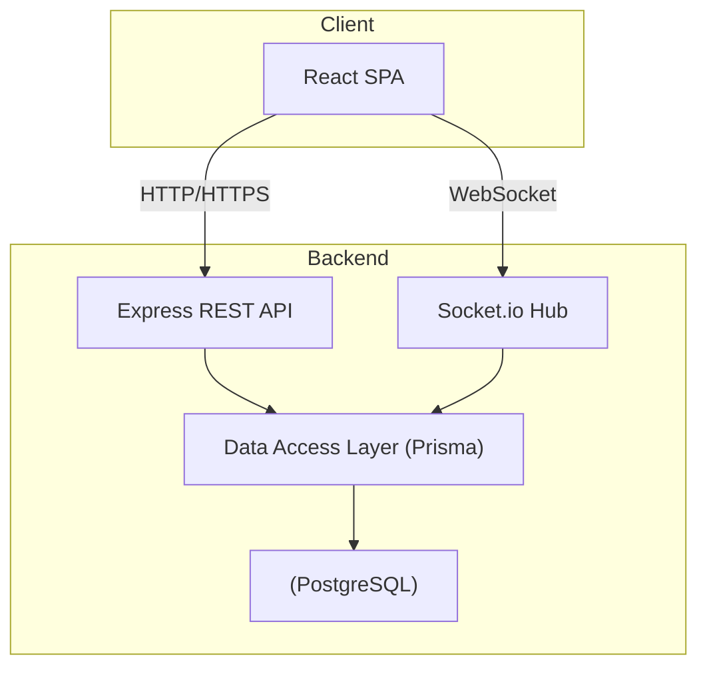

# Architect Mission Report

**Agent**: architect  
**Generated**: 2026-08-08T12:39:27.194Z

---

## Architecture Style

Modular Monolith

## Components

- **React SPA** (Frontend): Client‑side single‑page application handling UI, state, and real‑time communication.
- **Express REST API** (Backend Service): HTTP API for session, column, card, vote, and action‑item CRUD operations.
- **Socket.io Hub** (Backend Service): WebSocket server broadcasting real‑time updates (card moves, votes, action‑item changes) to all participants.
- **Data Access Layer** (Backend Component): Prisma‑based abstraction over the relational store, exposing typed queries for sessions, cards, votes, etc.
- **PostgreSQL** (Database): Relational database persisting sessions, columns, cards, votes, clusters, and action items.

## Tech Stack

- **Frontend Framework**: React 18 with Vite — React has the largest ecosystem, mature component libraries, and built‑in support for drag‑and‑drop libraries (e.g., react‑beautiful‑dnd). Vite provides fast dev server and minimal config. Vue and Svelte are viable but the team’s existing expertise is in React, reducing ramp‑up time.
- **Backend Framework**: Node.js 20 with Express 4 — Express is lightweight, easy to extend with Socket.io, and matches the JavaScript stack of the frontend, allowing shared code (e.g., validation schemas). NestJS adds unnecessary abstraction for a single service; FastAPI would require a different language stack and increase context switching.
- **Real‑time Transport**: Socket.io 4 — Socket.io handles reconnection, fallback transports, and room management out of the box, simplifying real‑time collaboration. Bare WebSocket would require custom reconnection logic. Firebase adds external vendor lock‑in and cost, which is unnecessary for a simple MVP.
- **Database**: PostgreSQL 15 — PostgreSQL offers strong relational modeling for sessions, cards, votes, and action items, with ACID guarantees and easy scaling later. SQLite is too limited for concurrent writes in multi‑user real‑time scenarios. MongoDB would require a document model that adds complexity without clear benefit.
- **ORM / Data Access**: Prisma 5 — Prisma provides type‑safe queries, automatic migrations, and excellent developer experience with VS Code integration. TypeORM has a heavier runtime and more boilerplate; Sequelize is older and less type‑centric.
- **Containerization / Deployment**: Docker Compose — Docker Compose gives reproducible local/dev environments and simple production deployment on a single VM. Kubernetes is overkill for a single‑service MVP. Heroku abstracts containers but adds platform lock‑in and limited control over WebSocket scaling.
- **CI/CD**: GitHub Actions — GitHub Actions integrates directly with the repository, supports Docker builds, and is free for public/open‑source projects. GitLab CI would require moving the repo; CircleCI adds external service complexity.
- **Testing**: Jest + React Testing Library + Supertest — Jest provides fast unit testing with built‑in mocking; React Testing Library encourages testing from the user’s perspective. Supertest validates the Express API. Mocha/Chai is older and lacks the integrated experience; Cypress is great for E2E but not needed for unit coverage.
- **Logging / Observability**: Winston (JSON logs) + Prometheus client — Winston is widely used, supports transports, and outputs structured JSON for log aggregation. Pino is faster but requires more setup for transports; Log4js is less actively maintained.

## Epics

- **E1** Session Management: Facilitator can create a new retro session, obtain a shareable random URL, and participants can join without authentication.
- **E2** Column & Card CRUD: Create, rename, add, edit, and delete columns and cards; support author attribution and per‑user edit permissions.
- **E3** Real‑time Collaboration: Broadcast all changes (card moves, edits, votes, action items) to every connected participant with low latency and graceful reconnection handling.
- **E4** Grouping & Voting: Allow participants to drag cards into clusters, assign a configurable number of votes per session, and display vote counts in the UI.
- **E5** Action Items Management: Facilitator can turn any card or cluster into an actionable item, assign owners, set due dates, and track completion status.
- **E6** Offline Support & Sync Resilience: Enable the SPA to function when the WebSocket connection is lost, queue local changes, and synchronize them once connectivity is restored.

## Architecture Diagram

