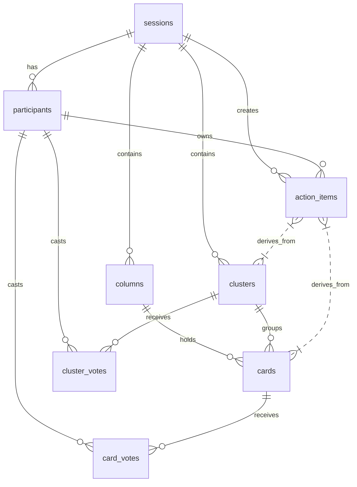

# DBA Mission Report

**Agent**: dba  
**Generated**: 2026-08-08T12:40:14.737Z

---

## Database Engine: PostgreSQL 15

PostgreSQL provides strong ACID guarantees, rich relational modeling, native UUID support, powerful indexing (GIN, B‑tree) and works seamlessly with Prisma. It matches the chosen tech stack and can be horizontally scaled behind a load balancer for the real‑time retro board use‑case.

## Entities (8)

- **sessions**: 7 columns
- **participants**: 6 columns
- **columns**: 6 columns
- **clusters**: 6 columns
- **cards**: 9 columns
- **card_votes**: 6 columns
- **cluster_votes**: 6 columns
- **action_items**: 10 columns

## ERD

